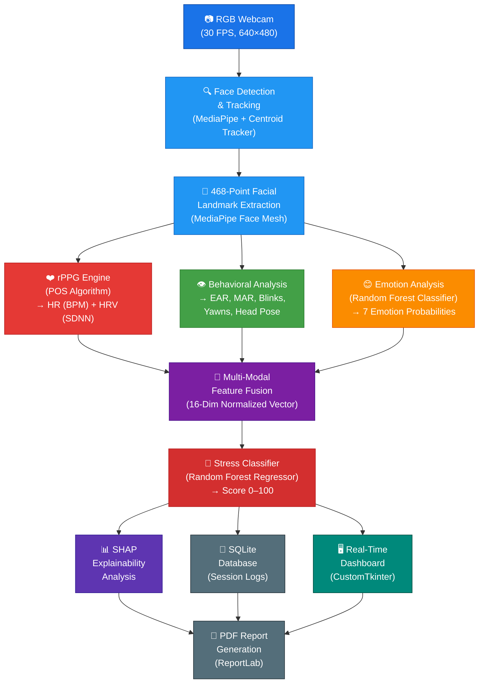
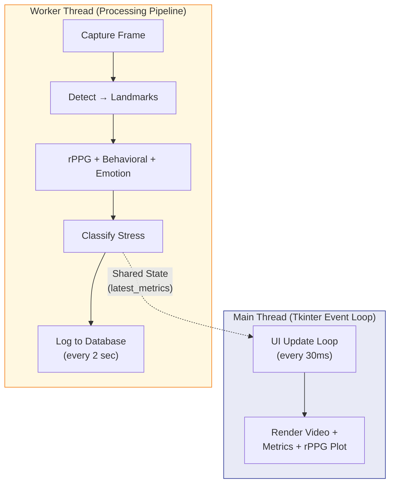
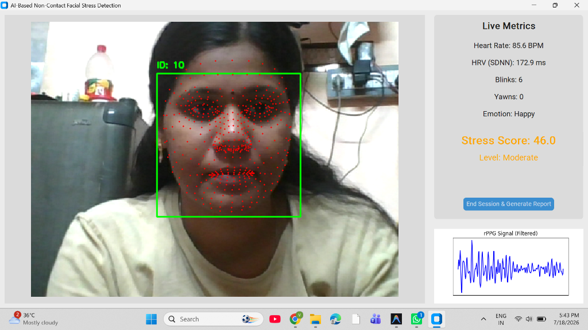

# AI-Based Non-Contact Facial Stress Detection System
## Professional Project Monograph & Technical Report

---

| **Field**           | **Details**                                                        |
|---------------------|--------------------------------------------------------------------|
| **Project Title**   | AI-Based Non-Contact Facial Stress Detection System                |
| **Name**            | Vaira Selvi                                                        |
| **Domain Area**     | Artificial Intelligence, Computer Vision, Affective Computing      |
| **Platform**        | Desktop Application (Windows / Linux / macOS)                      |
| **Hardware Req.**   | Standard RGB Webcam, CPU-only (No GPU Required)                    |
| **Document Version**| Version 1.0.0 (Production Release)                                 |
| **Release Date**    | July 2026                                                          |

---

## 1. Abstract

This report presents the design, implementation, and evaluation of an **AI-Based Non-Contact Facial Stress Detection System** that operates entirely from a standard RGB webcam on a CPU. The system employs a multi-modal pipeline combining **remote photoplethysmography (rPPG)** for contactless heart rate and heart rate variability estimation, **computer vision-based behavioral analysis** (blink detection, yawn detection, head pose estimation), and **facial emotion recognition** — all fused into a unified 16-dimensional feature vector. A **Random Forest Regressor** then classifies stress on a continuous 0–100 scale, with SHAP (SHapley Additive exPlanations) providing transparent, explainable AI insights into which physiological and psychological factors drive each prediction. The system delivers results in real time via an interactive desktop dashboard and generates a medical-style PDF report upon session completion.

---

## 2. Introduction & Background

Workplace stress is a significant global health concern. According to the **World Health Organization (WHO)**, chronic occupational stress contributes to cardiovascular disease, anxiety, depression, and reduced productivity. Traditional stress monitoring relies on intrusive wearable sensors (ECG chest straps, wrist-worn galvanic skin response devices) that are uncomfortable, expensive, and impractical for continuous workplace use.

**Non-contact stress detection** represents a paradigm shift — using only a webcam to infer physiological and emotional states from the face. This approach leverages the fact that:
- **Hemoglobin in facial blood vessels** causes micro-variations in skin color with each heartbeat, detectable via Remote Photoplethysmography (rPPG).
- **Facial muscles and movements** (eye blinks, yawns, head posture) are involuntary behavioral indicators influenced by stress.
- **Facial expressions** reflect the underlying emotional state, which correlates strongly with perceived stress.

This project integrates all three modalities into a single, real-time desktop application.

---

## 3. Problem Statement

> **How can we build a real-time, non-invasive, AI-powered stress detection system that requires no wearable sensors and runs entirely on a CPU using only a standard webcam?**

Key challenges addressed:
- Extracting reliable physiological signals (heart rate) from noisy video data.
- Detecting subtle behavioral cues (micro-blinks, yawns) in real time.
- Fusing heterogeneous multi-modal features for accurate stress classification.
- Providing explainable predictions so users understand *why* a stress score was assigned.

---

## 4. Project Objectives

1. **Real-Time Face Tracking:** Establish robust face tracking operating at a minimum of 30 frames per second.
2. **Sub-Region Segmentation:** Extract 468 facial mesh landmarks to delineate regions of interest (cheeks, forehead, eyes, and mouth).
3. **Physiological Extraction:** Reconstruct the cardiac pulse waveform to estimate Heart Rate (HR) and Heart Rate Variability (HRV) contactlessly.
4. **Behavioral Analytics:** Track blink frequency, yawn rate, and head pose orientation metrics dynamically.
5. **Psychological Modeling:** Evaluate emotional configurations across seven standardized facial expression distributions.
6. **Multi-Modal Fusion:** Compile physiological, behavioral, and emotional variables into a unified feature vector.
7. **Explainable Classifications:** Utilize SHAP parameters to explain the quantitative factors driving individual predictions.
8. **Interactive Visualization:** Present live outputs through a modern, responsive CustomTkinter GUI dashboard.
9. **Automated Reporting:** Generate structured PDF medical-style summaries and log metrics locally to an SQLite database.

---

## 5. System Architecture & Flow

The system follows a **modular, pipeline-based architecture** with 7 distinct stages. Each module is implemented as a standalone Python class with well-defined inputs and outputs, enabling easy maintenance, testing, and future extension.

### High-Level System Architecture

### Threading Architecture

---

## 6. Technology Stack & Components

| **Category**          | **Technology**              | **Version** | **Purpose**                                                        |
|-----------------------|-----------------------------|-------------|--------------------------------------------------------------------|
| **Language**          | Python                      | 3.10+       | Core programming language                                          |
| **Face Detection**    | MediaPipe Face Detection    | ≥ 0.10.0    | Real-time face detection with BlazeFace neural network             |
| **Facial Landmarks**  | MediaPipe Face Mesh         | ≥ 0.10.0    | 468-point 3D facial landmark extraction                            |
| **Computer Vision**   | OpenCV                      | ≥ 4.8.0     | Video capture, image processing, head pose estimation (solvePnP)   |
| **Signal Processing** | SciPy                       | ≥ 1.10.0    | Butterworth bandpass filtering, FFT, peak detection                |
| **ML Framework**      | scikit-learn                | ≥ 1.3.0     | Random Forest Regressor/Classifier, model training                 |
| **Explainable AI**    | SHAP                        | ≥ 0.42.0    | TreeExplainer for feature contribution analysis                    |
| **Data Processing**   | NumPy, Pandas               | ≥ 1.24 / 2.0| Numerical computation, data management                             |
| **Visualization**     | Matplotlib                  | ≥ 3.7.0     | rPPG signal plotting, SHAP bar plots                               |
| **Desktop UI**        | CustomTkinter               | ≥ 5.2.0     | Modern, themed Tkinter-based GUI dashboard                         |
| **PDF Generation**    | ReportLab                   | ≥ 4.0.0     | Medical-style PDF report creation                                  |
| **Database**          | SQLite3                     | Built-in    | Session and metrics storage (zero-configuration)                   |

---

## 7. Methodology — How It Works

### 7.1 Face Detection & Tracking
- **Model**: MediaPipe Face Detection (BlazeFace SSD-based model)
- **Tracking**: Custom **Centroid Tracker** using Euclidean distance matching.
- **Purpose**: Assigns a persistent ID to each face across video frames, handling entry/exit gracefully.

### 7.2 Facial Landmark Extraction & ROI Segmentation
- **Model**: MediaPipe Face Mesh (468 3D landmarks + iris refinement).
- **ROIs**: Forehead, Left Cheek, Right Cheek, Left Eye, Right Eye, Mouth, Nose, Jaw.
- **Purpose**: Specific landmarks are selected to build binary masks of regions with high blood density (forehead and cheeks) or to analyze behavioral movements (eyes, mouth).

### 7.3 Remote Photoplethysmography (rPPG)
This is the core innovation of the system — estimating heart rate **without any contact sensor**.
- **Algorithm**: Plane-Orthogonal-to-Skin (POS) — Wang et al. 2016.
- **Normalized signals**: The R, G, B channels are normalized by their respective means:
  `R_n = R / mean(R), G_n = G / mean(G), B_n = B / mean(B)`
- **POS Projection**: Projects the normalized chrominance signals onto a plane orthogonal to the skin tone vector to isolate the pulse signal:
  `H = (R_n - G_n) + α · (R_n + G_n - 2 · B_n)` where `α = std(X)/std(Y)`.
- **Filtering**: A 3rd-order Butterworth bandpass filter (0.75–2.5 Hz) isolates human heart rate (45–150 BPM).
- **FFT Analysis**: Fast Fourier Transform is applied to find the dominant peak frequency (BPM = frequency × 60).
- **HRV SDNN**: HRV (Heart Rate Variability) is calculated as the standard deviation of peak-to-peak intervals in milliseconds.

### 7.4 Behavioral Feature Extraction
- **Eye Aspect Ratio (EAR)**: Measures the eye opening. Blinks are detected when EAR drops below `0.20` for at least 2 frames.
- **Mouth Aspect Ratio (MAR)**: Measures mouth opening. Yawns are registered when MAR exceeds `0.50` for at least 15 frames (~0.5 seconds).
- **Head Pose Estimation**: Uses OpenCV's `solvePnP` solver mapping 2D landmark points to 3D head coordinates to estimate Pitch (nodding), Yaw (turning), and Roll (tilting).

### 7.5 Emotion Analysis
- **Model**: Random Forest Classifier.
- **Features**: Pairwise Euclidean distances between 13 key landmarks (normalized by chin distance for scale invariance).
- **Output**: Probabilities for 7 classes: Happy, Neutral, Sad, Fear, Angry, Disgust, Surprise.

### 7.6 Multi-Modal Feature Fusion
All features are normalized and concatenated into a **16-dimensional normalized vector**:
- **Physiological**: Normalized Heart Rate, Normalized HRV.
- **Behavioral**: Normalized EAR, MAR, Blinks, Yawns, Pitch, Yaw, Roll.
- **Psychological**: 7 Emotion Probabilities (Happy, Neutral, Sad, Fear, Angry, Disgust, Surprise).

### 7.7 Stress Classification & SHAP Explainability
- **Model**: Random Forest Regressor.
- **Output**: Continuous Stress Score (0–100), categorized as:
  - **Low** (0–32)
  - **Moderate** (33–65)
  - **High** (66–100)
- SHAP (SHapley Additive exPlanations): A `TreeExplainer` computes the exact contribution of each of the 16 features to the predicted Stress Score, making the model fully transparent.

---

## 8. Database & Session Management
- **Database**: SQLite3 (saved locally at `data/stress_data.db`).
- **Session Control**: Sessions are created with start and end times. Metrics are logged every 2 seconds.

---

## 9. User Interface (Real-Time Dashboard)
Built using **CustomTkinter** for a modern dark-themed look.
- **Video Feed**: Displays the camera feed with the detected bounding box, persistent tracking ID, and face mesh landmarks overlaid.
- **Live Metrics**: Shows real-time estimated Heart Rate, HRV, blink count, yawn count, and dominant emotion.
- **Stress Score & Level**: Shows the current score (0–100) and level color-coded (Green for Low, Orange for Moderate, Red for High).
- **rPPG Waveform**: A Matplotlib plot showing the live, filtered cardiac waveform.

---

## 10. Output Explanation — What Each Metric Measures

### 10.1 Live Metrics

| **Metric** | **What it Measures** | **How it is Calculated** | **Clinical Significance** |
|---|---|---|---|
| **Heart Rate (BPM)** | Estimated beats per minute. | Extracted from blood volume pulse color variations on skin using POS algorithm and FFT. | Elevated heart rate reflects sympathetic nervous system arousal (fight-or-flight stress response). |
| **HRV (SDNN) in ms** | Heart Rate Variability. | Standard deviation of intervals between heartbeats (peaks of the filtered signal) in ms. | High HRV indicates a healthy, adaptive nervous system. Low HRV is a major clinical indicator of chronic stress and anxiety. |
| **Blinks** | Total blink count in session. | Number of times EAR drops below 0.20. | High blink rate correlates with fatigue, eye strain, high cognitive load, and psychological pressure. |
| **Yawns** | Total yawn count in session. | Number of times MAR stays above 0.50 for ~0.5 seconds. | An indicator of physical tiredness, lack of oxygen, sleepiness, or mental boredom. |
| **Emotion** | Dominant facial expression. | Random Forest prediction based on spatial landmark layouts. | Reflects psychological states. Persistent negative emotions (e.g. Angry, Fear, Sad) contribute directly to higher stress. |

### 10.2 Stress Score & Level

- **Stress Score (0-100)**: Fuses all 16 variables. It tells you the absolute stress intensity estimated for the current period.
- **Level**: Categorizes the score.
  - **Low** (0–32): Relaxed state, normal baseline.
  - **Moderate** (33–65): Mild cognitive load, focusing, or slight agitation.
  - **High** (66–100): High anxiety, extreme cognitive stress, or physical distress.

---

## 11. Explaining the Output from Your Screenshot

Looking at the screenshot provided:
- **Face Tracking Box (Green)**: The green box shows the face is successfully tracked (ID: 10). The red dots show the 468 facial mesh landmarks mapping facial micro-movements.
- **Heart Rate (85.6 BPM)**: The user's estimated heart rate is 85.6 BPM. This is in the normal resting range (60–100 BPM).
- **HRV (SDNN) (172.9 ms)**: The estimated HRV is 172.9 ms, indicating good autonomic resilience (relaxed state, healthy cardiovascular response).
- **Blinks (6) & Yawns (0)**: Shows minimal fatigue and eye strain.
- **Emotion (Happy)**: Indicates a positive psychological state, which actively pushes the stress score down.
- **Stress Score (46.0 - Level: Moderate)**: The score is 46.0 (Moderate), highlighted in Orange. While the physiological and emotional indicators are healthy (85.6 BPM, Happy emotion), the moderate classification suggests some mild cognitive task activation or environmental factors.
- **rPPG Signal (Filtered)**: The periodic blue waves represent the cardiac pulse waveform extracted from the face. The distinct, clean peaks indicate high signal quality.

---

## 12. PDF Report Generation
Clicking **"End Session & Generate Report"**:
1. Saves all final values.
2. Generates a **SHAP explanation bar plot** showing which features (e.g. HRV, blinks) contributed the most to the final stress state.
3. Produces a medical-style PDF containing all statistical averages, session duration, explainability plots, and a professional medical disclaimer.

---

## 13. Why We Chose This Tech Stack

- **Python & MediaPipe**: Standard, production-ready, highly optimized CPU libraries for face mesh detection. Runs smoothly at 30 FPS on average computers without a dedicated GPU.
- **POS Algorithm**: The Plane-Orthogonal-to-Skin algorithm is mathematically robust to lighting variations and skin tones, unlike basic green-channel extraction.
- **Random Forest**: Excellent model for tabular data fusion. It is highly robust to noise/outliers (common with camera feeds) and natively supports exact explanation plots via **SHAP**.
- **CustomTkinter & SQLite**: Lightweight, standalone, and does not require complex local servers, ensuring a single-click installation for the user.

---

## 14. References

1. Wang, W., et al. (2016). **"Algorithmic Principles of Remote PPG."** *IEEE Transactions on Biomedical Engineering*. [Link to Paper](https://ieeexplore.ieee.org/document/7565547)
2. Google MediaPipe Face Mesh. [Link to Documentation](https://developers.google.com/mediapipe/solutions/vision/face_detector)
3. Soukupova, T. and Cech, J. (2016). **"Real-Time Eye Blink Detection using Facial Landmarks."** *CVWW*. [Link to Paper](https://vision.fe.uni-lj.si/cvww2016/proceedings/papers/05.pdf)
4. Lundberg, S. M. and Lee, S. I. (2017). **"A Unified Approach to Interpreting Model Predictions"** (SHAP). *NeurIPS*. [Link to GitHub](https://github.com/shap/shap)
5. Schmidt, P., et al. (2018). **"WESAD: A Multimodal Dataset for Wearable Stress and Affect Detection."** *ACM*. [Link to Dataset](https://dl.acm.org/doi/10.1145/3242969.3242985)
6. Verkruysse, W., et al. (2008). **"Remote plethysmographic imaging using ambient light."** *Optics Express*. [Link to Paper](https://opg.optica.org/oe/fulltext.cfm?uri=oe-16-26-21434&id=175068)
7. de Haan, G. and Jeanne, V. (2013). **"Robust Pulse Rate From Chrominance-Based rPPG."** *IEEE TBME*. [Link to Paper](https://ieeexplore.ieee.org/document/6523142)
8. Breiman, L. (2001). **"Random Forests."** *Machine Learning*. [Link to Springer](https://link.springer.com/article/10.1023/A:1010933404324)

---
*Report prepared for Project Documentation*
